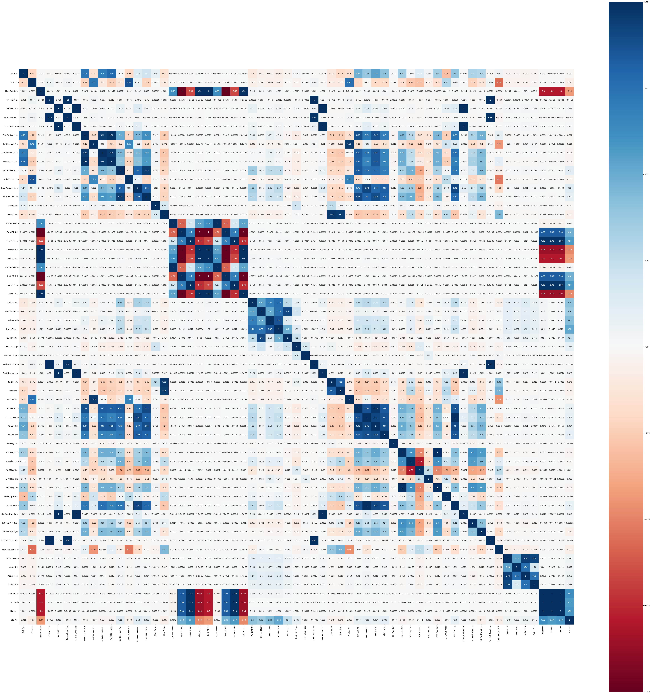
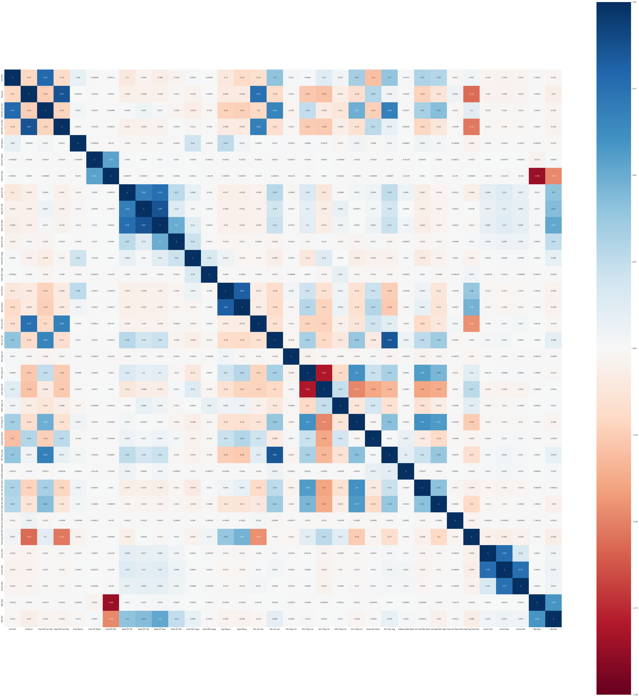

.. code:: ipython3

    # This Python 3 environment comes with many helpful analytics libraries installed
    # It is defined by the kaggle/python Docker image: https://github.com/kaggle/docker-python
    # For example, here's several helpful packages to load
    
    import numpy as np # linear algebra
    import pandas as pd # data processing, CSV file I/O (e.g. pd.read_csv)
    
    # Input data files are available in the read-only "../input/" directory
    # For example, running this (by clicking run or pressing Shift+Enter) will list all files under the input directory
    
    import os
    # for dirname, _, filenames in os.walk('/kaggle/input'):
    #     for filename in filenames:
    #         print(os.path.join(dirname, filename))
    
    # You can write up to 20GB to the current directory (/kaggle/working/) that gets preserved as output when you create a version using "Save & Run All" 
    # You can also write temporary files to /kaggle/temp/, but they won't be saved outside of the current session

.. code:: ipython3

    import warnings
    warnings.filterwarnings("ignore")

%%time
df_d1 = pd.read_csv("./02-14-2018.csv", low_memory=False)
df_d2 = pd.read_csv("./02-15-2018.csv", low_memory=False)
df_d3 = pd.read_csv("./02-16-2018.csv", low_memory=False)
# df_d4 = pd.read_csv("./02-20-2018.csv", low_memory=False)
df_d5 = pd.read_csv("./02-21-2018.csv", low_memory=False)
df_d6 = pd.read_csv("./02-22-2018.csv", low_memory=False)
df_d7 = pd.read_csv("./02-23-2018.csv", low_memory=False)
df_d8 = pd.read_csv("./02-28-2018.csv", low_memory=False)
df_d9 = pd.read_csv("./03-01-2018.csv", low_memory=False)
df_d10 = pd.read_csv("./03-02-2018.csv", low_memory=False)

.. code:: ipython3

    %%time
    df_d1 = pd.read_csv("./02-14-2018.csv", low_memory=False)
    df_d2 = pd.read_csv("./02-15-2018.csv", low_memory=False)
    df_d3 = pd.read_csv("./02-16-2018.csv", low_memory=False)
    # df_d4 = pd.read_csv("./02-20-2018.csv", low_memory=False)
    df_d5 = pd.read_csv("./02-21-2018.csv", low_memory=False)
    df_d6 = pd.read_csv("./02-22-2018.csv", low_memory=False)
    df_d7 = pd.read_csv("./02-23-2018.csv", low_memory=False)
    df_d8 = pd.read_csv("./02-28-2018.csv", low_memory=False)
    df_d9 = pd.read_csv("./03-01-2018.csv", low_memory=False)
    df_d10 = pd.read_csv("./03-02-2018.csv", low_memory=False)

.. parsed-literal::

    CPU times: user 50.5 s, sys: 4.01 s, total: 54.5 s
    Wall time: 54.5 s

.. code:: ipython3

    # df_d4.drop(columns=['Flow ID', 'Src IP', 'Src Port', 'Dst IP'], axis=1,inplace=True)

.. code:: ipython3

    def fix_data_type(df):
        
        df = df[df['Dst Port'] != 'Dst Port']
        
        df['Dst Port'] = df['Dst Port'].astype(int)
        df['Protocol'] = df['Protocol'].astype(int)
        df['Flow Duration'] = df['Flow Duration'].astype(int)
        df['Tot Fwd Pkts'] = df['Tot Fwd Pkts'].astype(int)
        df['Tot Bwd Pkts'] = df['Tot Bwd Pkts'].astype(int)
        df['TotLen Fwd Pkts'] = df['TotLen Fwd Pkts'].astype(int)
        df['TotLen Bwd Pkts'] = df['TotLen Bwd Pkts'].astype(int)
        df['Fwd Pkt Len Max'] = df['Fwd Pkt Len Max'].astype(int)
        df['Fwd Pkt Len Min'] = df['Fwd Pkt Len Min'].astype(int)
        df['Fwd Pkt Len Mean'] = df['Fwd Pkt Len Mean'].astype(float)
        df['Fwd Pkt Len Std'] = df['Fwd Pkt Len Std'].astype(float)
        df['Bwd Pkt Len Max'] = df['Bwd Pkt Len Max'].astype(int)
        df['Bwd Pkt Len Min'] = df['Bwd Pkt Len Min'].astype(int)
        df['Bwd Pkt Len Mean'] = df['Bwd Pkt Len Mean'].astype(float)
        df['Bwd Pkt Len Std'] = df['Bwd Pkt Len Std'].astype(float)
        df['Flow Byts/s'] = df['Flow Byts/s'].astype(float)
        df['Flow Pkts/s'] = df['Flow Pkts/s'].astype(float)
        df['Flow IAT Mean'] = df['Flow IAT Mean'].astype(float)
        df['Flow IAT Std'] = df['Flow IAT Std'].astype(float)
        df['Flow IAT Max'] = df['Flow IAT Max'].astype(int)
        df['Flow IAT Min'] = df['Flow IAT Min'].astype(int)
        df['Fwd IAT Tot'] = df['Fwd IAT Tot'].astype(int)
        df['Fwd IAT Mean'] = df['Fwd IAT Mean'].astype(float)
        df['Fwd IAT Std'] = df['Fwd IAT Std'].astype(float)
        df['Fwd IAT Max'] = df['Fwd IAT Max'].astype(int)
        df['Fwd IAT Min'] = df['Fwd IAT Min'].astype(int)
        df['Bwd IAT Tot'] = df['Bwd IAT Tot'].astype(int)
        df['Bwd IAT Mean'] = df['Bwd IAT Mean'].astype(float)
        df['Bwd IAT Std'] = df['Bwd IAT Std'].astype(float)
        df['Bwd IAT Max'] = df['Bwd IAT Max'].astype(int)
        df['Bwd IAT Min'] = df['Bwd IAT Min'].astype(int)
        df['Fwd PSH Flags'] = df['Fwd PSH Flags'].astype(int)
        df['Bwd PSH Flags'] = df['Bwd PSH Flags'].astype(int)
        df['Fwd URG Flags'] = df['Fwd URG Flags'].astype(int)
        df['Bwd URG Flags'] = df['Bwd URG Flags'].astype(int)
        df['Fwd Header Len'] = df['Fwd Header Len'].astype(int)
        df['Bwd Header Len'] = df['Bwd Header Len'].astype(int)
        df['Fwd Pkts/s'] = df['Fwd Pkts/s'].astype(float)
        df['Bwd Pkts/s'] = df['Bwd Pkts/s'].astype(float)
        df['Pkt Len Min'] = df['Pkt Len Min'].astype(int)
        df['Pkt Len Max'] = df['Pkt Len Max'].astype(int)
        df['Pkt Len Mean'] = df['Pkt Len Mean'].astype(float)
        df['Pkt Len Std'] = df['Pkt Len Std'].astype(float)
        df['Pkt Len Var'] = df['Pkt Len Var'].astype(float)
        df['FIN Flag Cnt'] = df['FIN Flag Cnt'].astype(int)
        df['SYN Flag Cnt'] = df['SYN Flag Cnt'].astype(int)
        df['RST Flag Cnt'] = df['RST Flag Cnt'].astype(int)
        df['PSH Flag Cnt'] = df['PSH Flag Cnt'].astype(int)
        df['ACK Flag Cnt'] = df['ACK Flag Cnt'].astype(int)
        df['URG Flag Cnt'] = df['URG Flag Cnt'].astype(int)
        df['CWE Flag Count'] = df['CWE Flag Count'].astype(int)
        df['ECE Flag Cnt'] = df['ECE Flag Cnt'].astype(int)
        df['Down/Up Ratio'] = df['Down/Up Ratio'].astype(int)
        df['Pkt Size Avg'] = df['Pkt Size Avg'].astype(float)
        df['Fwd Seg Size Avg'] = df['Fwd Seg Size Avg'].astype(float)
        df['Bwd Seg Size Avg'] = df['Bwd Seg Size Avg'].astype(float)
        df['Fwd Byts/b Avg'] = df['Fwd Byts/b Avg'].astype(int)
        df['Fwd Pkts/b Avg'] = df['Fwd Pkts/b Avg'].astype(int)
        df['Fwd Blk Rate Avg'] = df['Fwd Blk Rate Avg'].astype(int)
        df['Bwd Byts/b Avg'] = df['Bwd Byts/b Avg'].astype(int)
        df['Bwd Pkts/b Avg'] = df['Bwd Pkts/b Avg'].astype(int)
        df['Bwd Blk Rate Avg'] = df['Bwd Blk Rate Avg'].astype(int)
        df['Subflow Fwd Pkts'] = df['Subflow Fwd Pkts'].astype(int)
        df['Subflow Fwd Byts'] = df['Subflow Fwd Byts'].astype(int)
        df['Subflow Bwd Pkts'] = df['Subflow Bwd Pkts'].astype(int)
        df['Subflow Bwd Byts'] = df['Subflow Bwd Byts'].astype(int)
        df['Init Fwd Win Byts'] = df['Init Fwd Win Byts'].astype(int)
        df['Init Bwd Win Byts'] = df['Init Bwd Win Byts'].astype(int)
        df['Fwd Act Data Pkts'] = df['Fwd Act Data Pkts'].astype(int)
        df['Fwd Seg Size Min'] = df['Fwd Seg Size Min'].astype(int)
        df['Active Mean'] = df['Active Mean'].astype(float)
        df['Active Std'] = df['Active Std'].astype(float)
        df['Active Max'] = df['Active Max'].astype(int)
        df['Active Min'] = df['Active Min'].astype(int)
        df['Idle Mean'] = df['Idle Mean'].astype(float)
        df['Idle Std'] = df['Idle Std'].astype(float)
        df['Idle Max'] = df['Idle Max'].astype(int)
        df['Idle Min'] = df['Idle Min'].astype(int)
        
        return df

.. code:: ipython3

    %%time
    df_d1 = fix_data_type(df_d1)
    df_d2 = fix_data_type(df_d2)
    df_d3 = fix_data_type(df_d3)
    # df_d4 = fix_data_type(df_d4)
    df_d5 = fix_data_type(df_d5)
    df_d6 = fix_data_type(df_d6)
    df_d7 = fix_data_type(df_d7)
    df_d8 = fix_data_type(df_d8)
    df_d9 = fix_data_type(df_d9)
    df_d10 = fix_data_type(df_d10)

.. parsed-literal::

    CPU times: user 5.85 s, sys: 681 ms, total: 6.53 s
    Wall time: 6.54 s

.. code:: ipython3

    def drop_infinate_null(df):
        print (df.shape)
    
        # replace infinity value as null value
        df = df.replace(["Infinity", "infinity"], np.inf)
        df = df.replace([np.inf, -np.inf], np.nan)
    
        # drop all null values
        df.dropna(inplace=True)
    
        print (df.shape)
        
        return df

.. code:: ipython3

    %%time
    df_d1 = drop_infinate_null(df_d1)
    df_d2 = drop_infinate_null(df_d2)
    df_d3 = drop_infinate_null(df_d3)
    # df_d4 = drop_infinate_null(df_d4)
    df_d5 = drop_infinate_null(df_d5)
    df_d6 = drop_infinate_null(df_d6)
    df_d7 = drop_infinate_null(df_d7)
    df_d8 = drop_infinate_null(df_d8)
    df_d9 = drop_infinate_null(df_d9)
    df_d10 = drop_infinate_null(df_d10)

.. parsed-literal::

    (1048575, 80)
    (1044751, 80)
    (1048575, 80)
    (1040548, 80)
    (1048574, 80)
    (1048574, 80)
    (1048575, 80)
    (1048575, 80)
    (1048575, 80)
    (1042965, 80)
    (1048575, 80)
    (1042867, 80)
    (613071, 80)
    (606902, 80)
    (331100, 80)
    (328181, 80)
    (1048575, 80)
    (1044525, 80)
    CPU times: user 3.2 s, sys: 1.36 s, total: 4.56 s
    Wall time: 4.55 s

.. code:: ipython3

    def drop_unnecessary_column(df): 
        df.drop(columns="Timestamp", inplace=True)
        print (df.shape)
        return df

.. code:: ipython3

    %%time
    df_d1 = drop_unnecessary_column(df_d1)
    df_d2 = drop_unnecessary_column(df_d2)
    df_d3 = drop_unnecessary_column(df_d3)
    # df_d4 = drop_unnecessary_column(df_d4)
    df_d5 = drop_unnecessary_column(df_d5)
    df_d6 = drop_unnecessary_column(df_d6)
    df_d7 = drop_unnecessary_column(df_d7)
    df_d8 = drop_unnecessary_column(df_d8)
    df_d9 = drop_unnecessary_column(df_d9)
    df_d10 = drop_unnecessary_column(df_d10)

.. parsed-literal::

    (1044751, 79)
    (1040548, 79)
    (1048574, 79)
    (1048575, 79)
    (1042965, 79)
    (1042867, 79)
    (606902, 79)
    (328181, 79)
    (1044525, 79)
    CPU times: user 216 ms, sys: 166 ms, total: 382 ms
    Wall time: 380 ms

.. code:: ipython3

    def generate_binary_label(df):
        # encode the target feature
        df['Threat'] = df['Label'].apply(lambda x: "Benign" if x == 'Benign' else "Malicious")
        print(df['Threat'].unique())
        print(df['Threat'].value_counts())
        return df

.. code:: ipython3

    %%time
    df_d1 = generate_binary_label(df_d1)
    df_d2 = generate_binary_label(df_d2)
    df_d3 = generate_binary_label(df_d3)
    # df_d4 = generate_binary_label(df_d4)
    df_d5 = generate_binary_label(df_d5)
    df_d6 = generate_binary_label(df_d6)
    df_d7 = generate_binary_label(df_d7)
    df_d8 = generate_binary_label(df_d8)
    df_d9 = generate_binary_label(df_d9)
    df_d10 = generate_binary_label(df_d10)

.. parsed-literal::

    ['Benign' 'Malicious']
    Threat
    Benign       663808
    Malicious    380943
    Name: count, dtype: int64
    ['Benign' 'Malicious']
    Threat
    Benign       988050
    Malicious     52498
    Name: count, dtype: int64
    ['Benign' 'Malicious']
    Threat
    Malicious    601802
    Benign       446772
    Name: count, dtype: int64
    ['Benign' 'Malicious']
    Threat
    Malicious    687742
    Benign       360833
    Name: count, dtype: int64
    ['Benign' 'Malicious']
    Threat
    Benign       1042603
    Malicious        362
    Name: count, dtype: int64
    ['Benign' 'Malicious']
    Threat
    Benign       1042301
    Malicious        566
    Name: count, dtype: int64
    ['Benign' 'Malicious']
    Threat
    Benign       538666
    Malicious     68236
    Name: count, dtype: int64
    ['Benign' 'Malicious']
    Threat
    Benign       235778
    Malicious     92403
    Name: count, dtype: int64
    ['Benign' 'Malicious']
    Threat
    Benign       758334
    Malicious    286191
    Name: count, dtype: int64
    CPU times: user 703 ms, sys: 20.8 ms, total: 724 ms
    Wall time: 722 ms

.. code:: ipython3

    def reduce_mem_usage(props):
        start_mem_usg = props.memory_usage().sum() / 1024**2 
        print("Memory usage of properties dataframe is :",start_mem_usg," MB")
        NAlist = [] 
        for col in props.columns:
            if props[col].dtype != object:  
    
                IsInt = False
                mx = props[col].max()
                mn = props[col].min()
                
                if not np.isfinite(props[col]).all(): 
                    NAlist.append(col)
                    props[col].fillna(mn-1,inplace=True)  
                       
                asint = props[col].fillna(0).astype(np.int64)
                result = (props[col] - asint)
                result = result.sum()
                if result > -0.01 and result < 0.01:
                    IsInt = True
                
                if IsInt:
                    if mn >= 0:
                        if mx < 255:
                            props[col] = props[col].astype(np.uint8)
                        elif mx < 65535:
                            props[col] = props[col].astype(np.uint16)
                        elif mx < 4294967295:
                            props[col] = props[col].astype(np.uint32)
                        else:
                            props[col] = props[col].astype(np.uint64)
                    else:
                        if mn > np.iinfo(np.int8).min and mx < np.iinfo(np.int8).max:
                            props[col] = props[col].astype(np.int8)
                        elif mn > np.iinfo(np.int16).min and mx < np.iinfo(np.int16).max:
                            props[col] = props[col].astype(np.int16)
                        elif mn > np.iinfo(np.int32).min and mx < np.iinfo(np.int32).max:
                            props[col] = props[col].astype(np.int32)
                        elif mn > np.iinfo(np.int64).min and mx < np.iinfo(np.int64).max:
                            props[col] = props[col].astype(np.int64)    
                
                else:
                    props[col] = props[col].astype(np.float32)
        
        print("___MEMORY USAGE AFTER COMPLETION:___")
        mem_usg = props.memory_usage().sum() / 1024**2 
        print("Memory usage is: ",mem_usg," MB")
        print("This is ",100*mem_usg/start_mem_usg,"% of the initial size")
        return props, NAlist

.. code:: ipython3

    %%time
    df_d1, _ = reduce_mem_usage(df_d1)
    df_d2, _ = reduce_mem_usage(df_d2)
    df_d3, _ = reduce_mem_usage(df_d3)
    # df_d4, _ = reduce_mem_usage(df_d4)
    df_d5, _ = reduce_mem_usage(df_d5)
    df_d6, _ = reduce_mem_usage(df_d6)
    df_d7, _ = reduce_mem_usage(df_d7)
    df_d8, _ = reduce_mem_usage(df_d8)
    df_d9, _ = reduce_mem_usage(df_d9)
    df_d10, _ = reduce_mem_usage(df_d10)

.. parsed-literal::

    Memory usage of properties dataframe is : 645.6362228393555  MB
    ___MEMORY USAGE AFTER COMPLETION:___
    Memory usage is:  279.97496700286865  MB
    This is  43.364197530864196 % of the initial size
    Memory usage of properties dataframe is : 643.0388488769531  MB
    ___MEMORY USAGE AFTER COMPLETION:___
    Memory usage is:  247.09363174438477  MB
    This is  38.425925925925924 % of the initial size
    Memory usage of properties dataframe is : 647.9987640380859  MB
    ___MEMORY USAGE AFTER COMPLETION:___
    Memory usage is:  235.99954986572266  MB
    This is  36.41975308641975 % of the initial size
    Memory usage of properties dataframe is : 639.9995155334473  MB
    ___MEMORY USAGE AFTER COMPLETION:___
    Memory usage is:  238.99989795684814  MB
    This is  37.34376232420096 % of the initial size
    Memory usage of properties dataframe is : 644.5325088500977  MB
    ___MEMORY USAGE AFTER COMPLETION:___
    Memory usage is:  279.4963502883911  MB
    This is  43.364197530864196 % of the initial size
    Memory usage of properties dataframe is : 644.4719467163086  MB
    ___MEMORY USAGE AFTER COMPLETION:___
    Memory usage is:  251.6225347518921  MB
    This is  39.04320987654321 % of the initial size
    Memory usage of properties dataframe is : 375.0538787841797  MB
    ___MEMORY USAGE AFTER COMPLETION:___
    Memory usage is:  147.5906467437744  MB
    This is  39.351851851851855 % of the initial size
    Memory usage of properties dataframe is : 202.80960845947266  MB
    ___MEMORY USAGE AFTER COMPLETION:___
    Memory usage is:  78.5574254989624  MB
    This is  38.73456790123457 % of the initial size
    Memory usage of properties dataframe is : 645.4965591430664  MB
    ___MEMORY USAGE AFTER COMPLETION:___
    Memory usage is:  252.02257633209229  MB
    This is  39.04320987654321 % of the initial size
    CPU times: user 992 ms, sys: 263 ms, total: 1.25 s
    Wall time: 1.25 s

.. code:: ipython3

    ## https://www.researchgate.net/figure/Attack-Types-in-CSE-CIC-IDS2018-dataset_tbl1_333894962
    
    mapping= {'SSH-Bruteforce': 'Brute-force',
              'FTP-BruteForce': 'Brute-force',
              ################ Brute-force 
              
              'Brute Force -XSS': 'Web attack',
              'Brute Force -Web': 'Web attack',
              'SQL Injection': 'Web attack',
              ################ Web attack 
              
              'DoS attacks-Hulk': 'DoS attack',
              'DoS attacks-SlowHTTPTest': 'DoS attack',
              'DoS attacks-Slowloris': 'DoS attack',
              'DoS attacks-GoldenEye': 'DoS attack',
              ################ DoS attack 
              
              'DDOS attack-HOIC': 'DDoS attack',
              'DDOS attack-LOIC-UDP': 'DDoS attack',
              'DDoS attacks-LOIC-HTTP': 'DDoS attack',
              ################ DDoS attack 
              
              'Bot': 'Botnet',
              ################ Botnet 
              
              'Infilteration': 'Infilteration',
              ################ Infilteration 
              
              'Benign': 'Benign',
              'Label': 'Benign',
              ################ Infilteration 
        }
    
    def transform_multi_label(df):
        print(df['Label'].value_counts())
        df['Label'] = df['Label'].map(mapping) 
        return df

.. code:: ipython3

    %%time
    df_d1 = transform_multi_label(df_d1)
    df_d2 = transform_multi_label(df_d2)
    df_d3 = transform_multi_label(df_d3)
    # df_d4 = transform_multi_label(df_d4)
    df_d5 = transform_multi_label(df_d5)
    df_d6 = transform_multi_label(df_d6)
    df_d7 = transform_multi_label(df_d7)
    df_d8 = transform_multi_label(df_d8)
    df_d9 = transform_multi_label(df_d9)
    df_d10 = transform_multi_label(df_d10)

.. parsed-literal::

    Label
    Benign            663808
    FTP-BruteForce    193354
    SSH-Bruteforce    187589
    Name: count, dtype: int64
    Label
    Benign                   988050
    DoS attacks-GoldenEye     41508
    DoS attacks-Slowloris     10990
    Name: count, dtype: int64
    Label
    DoS attacks-Hulk            461912
    Benign                      446772
    DoS attacks-SlowHTTPTest    139890
    Name: count, dtype: int64
    Label
    DDOS attack-HOIC        686012
    Benign                  360833
    DDOS attack-LOIC-UDP      1730
    Name: count, dtype: int64
    Label
    Benign              1042603
    Brute Force -Web        249
    Brute Force -XSS         79
    SQL Injection            34
    Name: count, dtype: int64
    Label
    Benign              1042301
    Brute Force -Web        362
    Brute Force -XSS        151
    SQL Injection            53
    Name: count, dtype: int64
    Label
    Benign           538666
    Infilteration     68236
    Name: count, dtype: int64
    Label
    Benign           235778
    Infilteration     92403
    Name: count, dtype: int64
    Label
    Benign    758334
    Bot       286191
    Name: count, dtype: int64
    CPU times: user 396 ms, sys: 17.4 ms, total: 413 ms
    Wall time: 412 ms

.. code:: ipython3

    from imblearn.under_sampling import RandomUnderSampler
    
    def balance_data(df):
        X=df.drop(["Label"], axis=1)
        y=df["Label"]
    
        rus = RandomUnderSampler()
        X_balanced, y_balanced = rus.fit_resample(X, y) 
    
        df = pd.concat([X_balanced, y_balanced], axis=1)
        del X, y, X_balanced, y_balanced
        print (df.shape)
        print(df['Label'].value_counts())
        
        return df

.. code:: ipython3

    %%time
    df_d1 = balance_data(df_d1)
    df_d2 = balance_data(df_d2)
    df_d3 = balance_data(df_d3)
    # df_d4 = balance_data(df_d4)
    df_d5 = balance_data(df_d5)
    df_d6 = balance_data(df_d6)
    df_d7 = balance_data(df_d7)
    df_d8 = balance_data(df_d8)
    df_d9 = balance_data(df_d9)
    df_d10 = balance_data(df_d10)

.. parsed-literal::

    (761886, 80)
    Label
    Benign         380943
    Brute-force    380943
    Name: count, dtype: int64
    (104996, 80)
    Label
    Benign        52498
    DoS attack    52498
    Name: count, dtype: int64
    (893544, 80)
    Label
    Benign        446772
    DoS attack    446772
    Name: count, dtype: int64
    (721666, 80)
    Label
    Benign         360833
    DDoS attack    360833
    Name: count, dtype: int64
    (724, 80)
    Label
    Benign        362
    Web attack    362
    Name: count, dtype: int64
    (1132, 80)
    Label
    Benign        566
    Web attack    566
    Name: count, dtype: int64
    (136472, 80)
    Label
    Benign           68236
    Infilteration    68236
    Name: count, dtype: int64
    (184806, 80)
    Label
    Benign           92403
    Infilteration    92403
    Name: count, dtype: int64
    (572382, 80)
    Label
    Benign    286191
    Botnet    286191
    Name: count, dtype: int64
    CPU times: user 11.9 s, sys: 615 ms, total: 12.6 s
    Wall time: 12.6 s

.. code:: ipython3

    %%time
    df_all = pd.concat([df_d1, df_d2], axis=0)
    df_all.reset_index(drop=True, inplace=True)
    del df_d1, df_d2
    
    df_all = pd.concat([df_all, df_d3], axis=0)
    df_all.reset_index(drop=True, inplace=True)
    del df_d3
    
    # df_all = pd.concat([df_all, df_d4], axis=0)
    # df_all.reset_index(drop=True, inplace=True)
    # del df_d4
    
    df_all = pd.concat([df_all, df_d5], axis=0)
    df_all.reset_index(drop=True, inplace=True)
    del df_d5
    
    df_all = pd.concat([df_all, df_d6], axis=0)
    df_all.reset_index(drop=True, inplace=True)
    del df_d6
    
    df_all = pd.concat([df_all, df_d7], axis=0)
    df_all.reset_index(drop=True, inplace=True)
    del df_d7
    
    df_all = pd.concat([df_all, df_d8], axis=0)
    df_all.reset_index(drop=True, inplace=True)
    del df_d8
    
    df_all = pd.concat([df_all, df_d9], axis=0)
    df_all.reset_index(drop=True, inplace=True)
    del df_d9
    
    df_all = pd.concat([df_all, df_d10], axis=0)
    df_all.reset_index(drop=True, inplace=True)
    del df_d10

.. parsed-literal::

    CPU times: user 295 ms, sys: 422 ms, total: 717 ms
    Wall time: 719 ms

.. code:: ipython3

    # df_all = df_d4
    # del df_d4

.. code:: ipython3

    print(df_all['Label'].value_counts())

.. parsed-literal::

    Label
    Benign           1688804
    DoS attack        499270
    Brute-force       380943
    DDoS attack       360833
    Botnet            286191
    Infilteration     160639
    Web attack           928
    Name: count, dtype: int64

.. code:: ipython3

    # attack_df = df_all[df_all["Threat"] != "Benign"]
    # normal_df = df_all[df_all["Threat"] == "Benign"].sample(n=len(attack_df))

.. code:: ipython3

    # df_all = pd.concat([attack_df, normal_df], axis=0)
    # del attack_df, normal_df

.. code:: ipython3

    %%time
    variances = df_all.var(numeric_only=True)
    constant_columns = variances[variances == 0].index
    df_all = df_all.drop(constant_columns, axis=1)
    
    print(constant_columns)
    print (df_all.shape)

.. parsed-literal::

    Index(['Bwd PSH Flags', 'Bwd URG Flags', 'Fwd Byts/b Avg', 'Fwd Pkts/b Avg',
           'Fwd Blk Rate Avg', 'Bwd Byts/b Avg', 'Bwd Pkts/b Avg',
           'Bwd Blk Rate Avg'],
          dtype='object')
    (3377608, 72)
    CPU times: user 612 ms, sys: 265 ms, total: 877 ms
    Wall time: 876 ms

.. code:: ipython3

    %%time
    duplicates = set()
    for i in range(0, len(df_all.columns)):
        col1 = df_all.columns[i]
        for j in range(i+1, len(df_all.columns)):
            col2 = df_all.columns[j]
            if(df_all[col1].equals(df_all[col2])):
                duplicates.add(col2)

.. parsed-literal::

    CPU times: user 361 ms, sys: 360 ms, total: 722 ms
    Wall time: 720 ms

.. code:: ipython3

    print (duplicates)
    df_all.drop(duplicates, axis=1, inplace=True)
    print (df_all.shape)

.. parsed-literal::

    {'Bwd Seg Size Avg', 'SYN Flag Cnt', 'CWE Flag Count', 'Subflow Bwd Pkts', 'Fwd Seg Size Avg', 'Subflow Fwd Pkts', 'Subflow Fwd Byts'}
    (3377608, 65)

.. code:: ipython3

    from matplotlib import pyplot as plt
    import seaborn as sns
    
    # pearson correlation heatmap
    plt.figure(figsize=(70, 70))
    corr = df_all.corr(numeric_only=True)
    sns.heatmap(corr, annot=True, cmap='RdBu', vmin=-1, vmax=1, square=True) # annot=True
    plt.show()

.. code:: ipython3

    %%time
    correlated_col = set()
    is_correlated = [True] * len(corr.columns)
    threshold = 0.90
    for i in range (len(corr.columns)):
        if(is_correlated[i]):
            for j in range(i):
                if (np.abs(corr.iloc[i, j]) >= threshold) and (is_correlated[j]):
                    colname = corr.columns[j]
                    is_correlated[j]=False
                    correlated_col.add(colname)
    
    print(correlated_col)
    print(len(correlated_col))

.. parsed-literal::

    {'Fwd Pkt Len Mean', 'Active Mean', 'TotLen Bwd Pkts', 'Tot Bwd Pkts', 'Bwd IAT Mean', 'Fwd IAT Tot', 'Flow Pkts/s', 'Idle Mean', 'Pkt Len Std', 'Bwd Header Len', 'Flow IAT Min', 'Bwd Pkt Len Max', 'Fwd Pkt Len Min', 'Flow IAT Mean', 'Flow IAT Max', 'Tot Fwd Pkts', 'Pkt Len Mean', 'Fwd IAT Std', 'Flow IAT Std', 'Bwd Pkt Len Mean', 'Flow Duration', 'Fwd Pkt Len Max', 'TotLen Fwd Pkts', 'RST Flag Cnt', 'Fwd IAT Max', 'Idle Std', 'Bwd Pkt Len Std', 'Fwd Header Len', 'Pkt Len Max'}
    29
    CPU times: user 11.3 ms, sys: 1.07 ms, total: 12.4 ms
    Wall time: 12.3 ms

.. code:: ipython3

    %%time
    df_all.drop(correlated_col, axis=1, inplace=True)
    print (df_all.shape)

.. parsed-literal::

    (3377608, 36)
    CPU times: user 125 ms, sys: 48.8 ms, total: 173 ms
    Wall time: 173 ms

.. code:: ipython3

    %%time
    # pearson correlation heatmap
    plt.figure(figsize=(70, 70))
    corr = df_all.corr(numeric_only=True)
    sns.heatmap(corr, annot=True, cmap='RdBu', vmin=-1, vmax=1, square=True) # annot=True
    plt.show()

.. parsed-literal::

    CPU times: user 5.67 s, sys: 106 ms, total: 5.78 s
    Wall time: 5.24 s

.. code:: ipython3

    label_col = "Label"

.. code:: ipython3

    feature_cols = list(df_all.columns)
    feature_cols

.. parsed-literal::

    ['Dst Port',
     'Protocol',
     'Fwd Pkt Len Std',
     'Bwd Pkt Len Min',
     'Flow Byts/s',
     'Fwd IAT Mean',
     'Fwd IAT Min',
     'Bwd IAT Tot',
     'Bwd IAT Std',
     'Bwd IAT Max',
     'Bwd IAT Min',
     'Fwd PSH Flags',
     'Fwd URG Flags',
     'Fwd Pkts/s',
     'Bwd Pkts/s',
     'Pkt Len Min',
     'Pkt Len Var',
     'FIN Flag Cnt',
     'PSH Flag Cnt',
     'ACK Flag Cnt',
     'URG Flag Cnt',
     'ECE Flag Cnt',
     'Down/Up Ratio',
     'Pkt Size Avg',
     'Subflow Bwd Byts',
     'Init Fwd Win Byts',
     'Init Bwd Win Byts',
     'Fwd Act Data Pkts',
     'Fwd Seg Size Min',
     'Active Std',
     'Active Max',
     'Active Min',
     'Idle Max',
     'Idle Min',
     'Threat',
     'Label']

.. code:: ipython3

    label_col = 'Label'
    
    feature_cols.remove("Threat")
    feature_cols.remove(label_col)

.. code:: ipython3

    from sklearn.model_selection import train_test_split
    
    train_df, test_df = train_test_split(df_all, test_size=0.2, random_state=2, shuffle=True, stratify=df_all[label_col])
    
    del df_all 

.. code:: ipython3

    from sklearn.preprocessing import RobustScaler, MinMaxScaler
    
    minmax_scaler = MinMaxScaler()
    train_df[feature_cols] = minmax_scaler.fit_transform(train_df[feature_cols])
    test_df[feature_cols] = minmax_scaler.transform(test_df[feature_cols])

.. code:: ipython3

    order_label_list = list(np.unique(train_df[label_col]))
    order_label_list

.. parsed-literal::

    ['Benign',
     'Botnet',
     'Brute-force',
     'DDoS attack',
     'DoS attack',
     'Infilteration',
     'Web attack']

.. code:: ipython3

    import numpy as np
    from sklearn.utils import class_weight
    
    # Convert order_label_list to a numpy array
    order_label_array = np.array(order_label_list)
    
    class_weights = class_weight.compute_class_weight('balanced',
                                                     classes=order_label_array,
                                                     y=train_df[label_col].values)
    
    class_weights = {k: v for k,v in enumerate(class_weights)}
    class_weights

.. parsed-literal::

    {0: 0.2857142857142857,
     1: 1.6859892017762848,
     2: 1.2666356658625832,
     3: 1.3372280965347,
     4: 0.9664417191957401,
     5: 3.0037295306571865,
     6: 519.5320130744087}

.. code:: ipython3

    import json 
        
    with open("class_weights.json", "w") as outfile: 
        json.dump(class_weights, outfile)

.. code:: ipython3

    import json 
    
    label_dict = {v:v for v in order_label_list}
        
    with open("label_dict.json", "w") as outfile: 
        json.dump(label_dict, outfile)
    
    
        label_dict

.. code:: ipython3

    y_train = [order_label_list.index(k) for k in train_df[label_col]]
    y_test = [order_label_list.index(k) for k in test_df[label_col]]

.. code:: ipython3

    from xgboost import XGBClassifier
    from sklearn.metrics import classification_report
    
    model = XGBClassifier(n_estimators=100)
    %time
    model.fit(train_df[feature_cols].values, y_train)

.. parsed-literal::

    CPU times: user 0 ns, sys: 0 ns, total: 0 ns
    Wall time: 2.15 μs

.. raw:: html

    

<pre>XGBClassifier(base_score=None, booster=None, callbacks=None,
                  colsample_bylevel=None, colsample_bynode=None,
                  colsample_bytree=None, device=None, early_stopping_rounds=None,
                  enable_categorical=False, eval_metric=None, feature_types=None,
                  gamma=None, grow_policy=None, importance_type=None,
                  interaction_constraints=None, learning_rate=None, max_bin=None,
                  max_cat_threshold=None, max_cat_to_onehot=None,
                  max_delta_step=None, max_depth=None, max_leaves=None,
                  min_child_weight=None, missing=nan, monotone_constraints=None,
                  multi_strategy=None, n_estimators=100, n_jobs=None,
                  num_parallel_tree=None, objective=&#x27;multi:softprob&#x27;, ...)</pre><b>In a Jupyter environment, please rerun this cell to show the HTML representation or trust the notebook.  On GitHub, the HTML representation is unable to render, please try loading this page with nbviewer.org.</b>

<input class="sk-toggleable__control sk-hidden--visually" id="sk-estimator-id-1" type="checkbox" checked><label for="sk-estimator-id-1" class="sk-toggleable__label fitted sk-toggleable__label-arrow fitted">&nbsp;XGBClassifieriFitted</label>
<pre>XGBClassifier(base_score=None, booster=None, callbacks=None,
                  colsample_bylevel=None, colsample_bynode=None,
                  colsample_bytree=None, device=None, early_stopping_rounds=None,
                  enable_categorical=False, eval_metric=None, feature_types=None,
                  gamma=None, grow_policy=None, importance_type=None,
                  interaction_constraints=None, learning_rate=None, max_bin=None,
                  max_cat_threshold=None, max_cat_to_onehot=None,
                  max_delta_step=None, max_depth=None, max_leaves=None,
                  min_child_weight=None, missing=nan, monotone_constraints=None,
                  multi_strategy=None, n_estimators=100, n_jobs=None,
                  num_parallel_tree=None, objective=&#x27;multi:softprob&#x27;, ...)</pre>
 

.. code:: ipython3

    y_pred = model.predict(test_df[feature_cols].values)
    print(classification_report(y_test, y_pred))

.. parsed-literal::

                  precision    recall  f1-score   support
    
               0       0.94      0.99      0.96    337761
               1       1.00      1.00      1.00     57238
               2       0.87      0.95      0.91     76189
               3       1.00      1.00      1.00     72167
               4       0.96      0.89      0.92     99854
               5       0.72      0.32      0.44     32128
               6       0.91      0.93      0.92       185
    
        accuracy                           0.94    675522
       macro avg       0.91      0.87      0.88    675522
    weighted avg       0.93      0.94      0.93    675522
    

.. code:: ipython3

    ext=pd.DataFrame(model.feature_importances_,columns=["extratrees_importance"])
    ext = ext.sort_values(['extratrees_importance'], ascending=False)
    feature_index = [feature_cols[i] for i in list(ext.index)]
    ext["Feature_Name"] = feature_index
    ext

.. raw:: html

    

    
    <table border="1" class="dataframe">
      <thead>
        <tr style="text-align: right;">
          <th></th>
          <th>extratrees_importance</th>
          <th>Feature_Name</th>
        </tr>
      </thead>
      <tbody>
        <tr>
          <th>28</th>
          <td>0.302906</td>
          <td>Fwd Seg Size Min</td>
        </tr>
        <tr>
          <th>0</th>
          <td>0.203322</td>
          <td>Dst Port</td>
        </tr>
        <tr>
          <th>10</th>
          <td>0.112421</td>
          <td>Bwd IAT Min</td>
        </tr>
        <tr>
          <th>25</th>
          <td>0.074023</td>
          <td>Init Fwd Win Byts</td>
        </tr>
        <tr>
          <th>14</th>
          <td>0.055198</td>
          <td>Bwd Pkts/s</td>
        </tr>
        <tr>
          <th>4</th>
          <td>0.044546</td>
          <td>Flow Byts/s</td>
        </tr>
        <tr>
          <th>21</th>
          <td>0.034782</td>
          <td>ECE Flag Cnt</td>
        </tr>
        <tr>
          <th>2</th>
          <td>0.024799</td>
          <td>Fwd Pkt Len Std</td>
        </tr>
        <tr>
          <th>12</th>
          <td>0.024379</td>
          <td>Fwd URG Flags</td>
        </tr>
        <tr>
          <th>22</th>
          <td>0.019748</td>
          <td>Down/Up Ratio</td>
        </tr>
        <tr>
          <th>13</th>
          <td>0.019413</td>
          <td>Fwd Pkts/s</td>
        </tr>
        <tr>
          <th>19</th>
          <td>0.012745</td>
          <td>ACK Flag Cnt</td>
        </tr>
        <tr>
          <th>27</th>
          <td>0.011008</td>
          <td>Fwd Act Data Pkts</td>
        </tr>
        <tr>
          <th>26</th>
          <td>0.010599</td>
          <td>Init Bwd Win Byts</td>
        </tr>
        <tr>
          <th>24</th>
          <td>0.008376</td>
          <td>Subflow Bwd Byts</td>
        </tr>
        <tr>
          <th>16</th>
          <td>0.006812</td>
          <td>Pkt Len Var</td>
        </tr>
        <tr>
          <th>5</th>
          <td>0.004975</td>
          <td>Fwd IAT Mean</td>
        </tr>
        <tr>
          <th>17</th>
          <td>0.004381</td>
          <td>FIN Flag Cnt</td>
        </tr>
        <tr>
          <th>11</th>
          <td>0.003641</td>
          <td>Fwd PSH Flags</td>
        </tr>
        <tr>
          <th>6</th>
          <td>0.003316</td>
          <td>Fwd IAT Min</td>
        </tr>
        <tr>
          <th>20</th>
          <td>0.002951</td>
          <td>URG Flag Cnt</td>
        </tr>
        <tr>
          <th>30</th>
          <td>0.002651</td>
          <td>Active Max</td>
        </tr>
        <tr>
          <th>7</th>
          <td>0.002258</td>
          <td>Bwd IAT Tot</td>
        </tr>
        <tr>
          <th>23</th>
          <td>0.001675</td>
          <td>Pkt Size Avg</td>
        </tr>
        <tr>
          <th>9</th>
          <td>0.001497</td>
          <td>Bwd IAT Max</td>
        </tr>
        <tr>
          <th>32</th>
          <td>0.001372</td>
          <td>Idle Max</td>
        </tr>
        <tr>
          <th>3</th>
          <td>0.001344</td>
          <td>Bwd Pkt Len Min</td>
        </tr>
        <tr>
          <th>18</th>
          <td>0.001177</td>
          <td>PSH Flag Cnt</td>
        </tr>
        <tr>
          <th>15</th>
          <td>0.001004</td>
          <td>Pkt Len Min</td>
        </tr>
        <tr>
          <th>33</th>
          <td>0.000854</td>
          <td>Idle Min</td>
        </tr>
        <tr>
          <th>8</th>
          <td>0.000622</td>
          <td>Bwd IAT Std</td>
        </tr>
        <tr>
          <th>1</th>
          <td>0.000547</td>
          <td>Protocol</td>
        </tr>
        <tr>
          <th>31</th>
          <td>0.000411</td>
          <td>Active Min</td>
        </tr>
        <tr>
          <th>29</th>
          <td>0.000244</td>
          <td>Active Std</td>
        </tr>
      </tbody>
    </table>
    

.. code:: ipython3

    from sklearn.feature_selection import SelectFromModel
    
    # Fit the selector model on the training data
    selector_model = SelectFromModel(model)
    selector_model.fit(train_df[feature_cols], y_train)
    
    # Now you can use get_feature_names_out to get the selected features
    selected_features = list(selector_model.get_feature_names_out(input_features=feature_cols))
    selected_features

.. parsed-literal::

    ['Dst Port',
     'Flow Byts/s',
     'Bwd IAT Min',
     'Bwd Pkts/s',
     'ECE Flag Cnt',
     'Init Fwd Win Byts',
     'Fwd Seg Size Min']

.. code:: ipython3

    # selected_features = list(seletor_model.get_feature_names_out(input_features=feature_cols))
    # selected_features

.. code:: ipython3

    from xgboost import XGBClassifier
    from sklearn.metrics import classification_report
    
    model = XGBClassifier(n_estimators=100)
    %time
    model.fit(train_df[selected_features].values, y_train)

.. parsed-literal::

    CPU times: user 0 ns, sys: 1 μs, total: 1 μs
    Wall time: 3.1 μs

.. raw:: html

    

<pre>XGBClassifier(base_score=None, booster=None, callbacks=None,
                  colsample_bylevel=None, colsample_bynode=None,
                  colsample_bytree=None, device=None, early_stopping_rounds=None,
                  enable_categorical=False, eval_metric=None, feature_types=None,
                  gamma=None, grow_policy=None, importance_type=None,
                  interaction_constraints=None, learning_rate=None, max_bin=None,
                  max_cat_threshold=None, max_cat_to_onehot=None,
                  max_delta_step=None, max_depth=None, max_leaves=None,
                  min_child_weight=None, missing=nan, monotone_constraints=None,
                  multi_strategy=None, n_estimators=100, n_jobs=None,
                  num_parallel_tree=None, objective=&#x27;multi:softprob&#x27;, ...)</pre><b>In a Jupyter environment, please rerun this cell to show the HTML representation or trust the notebook.  On GitHub, the HTML representation is unable to render, please try loading this page with nbviewer.org.</b>

<input class="sk-toggleable__control sk-hidden--visually" id="sk-estimator-id-2" type="checkbox" checked><label for="sk-estimator-id-2" class="sk-toggleable__label fitted sk-toggleable__label-arrow fitted">&nbsp;XGBClassifieriFitted</label>
<pre>XGBClassifier(base_score=None, booster=None, callbacks=None,
                  colsample_bylevel=None, colsample_bynode=None,
                  colsample_bytree=None, device=None, early_stopping_rounds=None,
                  enable_categorical=False, eval_metric=None, feature_types=None,
                  gamma=None, grow_policy=None, importance_type=None,
                  interaction_constraints=None, learning_rate=None, max_bin=None,
                  max_cat_threshold=None, max_cat_to_onehot=None,
                  max_delta_step=None, max_depth=None, max_leaves=None,
                  min_child_weight=None, missing=nan, monotone_constraints=None,
                  multi_strategy=None, n_estimators=100, n_jobs=None,
                  num_parallel_tree=None, objective=&#x27;multi:softprob&#x27;, ...)</pre>
 

.. code:: ipython3

    y_pred = model.predict(test_df[selected_features].values)
    print(classification_report(y_test, y_pred))
    
    del y_pred, y_test, y_train

.. parsed-literal::

                  precision    recall  f1-score   support
    
               0       0.94      0.99      0.96    337761
               1       1.00      1.00      1.00     57238
               2       0.87      0.95      0.91     76189
               3       1.00      1.00      1.00     72167
               4       0.96      0.89      0.92     99854
               5       0.73      0.28      0.41     32128
               6       0.98      0.82      0.89       185
    
        accuracy                           0.94    675522
       macro avg       0.93      0.85      0.87    675522
    weighted avg       0.93      0.94      0.93    675522
    

.. code:: ipython3

    train_df[feature_cols+[label_col]].to_csv("train_df.csv",index=False)
    test_df[feature_cols+[label_col]].to_csv("test_df.csv",index=False)

.. code:: ipython3

    del train_df, test_df

.. code:: ipython3

    import json
    
    with open('label_dict.json') as json_file:
        label_dict = json.load(json_file)
    
    label_dict

.. parsed-literal::

    {'Benign': 'Benign',
     'Botnet': 'Botnet',
     'Brute-force': 'Brute-force',
     'DDoS attack': 'DDoS attack',
     'DoS attack': 'DoS attack',
     'Infilteration': 'Infilteration',
     'Web attack': 'Web attack'}

.. code:: ipython3

    import json
    
    with open('class_weights.json') as json_file:
        class_weights = json.load(json_file)
    
    class_weights

.. parsed-literal::

    {'0': 0.2857142857142857,
     '1': 1.6859892017762848,
     '2': 1.2666356658625832,
     '3': 1.3372280965347,
     '4': 0.9664417191957401,
     '5': 3.0037295306571865,
     '6': 519.5320130744087}

.. code:: ipython3

    import numpy as np
    import pandas as pd
    import matplotlib.pyplot as plt
    from sklearn.utils import shuffle
    import os
    import keras
    from keras.models import Sequential
    from keras.layers import Dense, Input
    from keras import optimizers
    import keras.backend as K
    import logging.config
    from gym import  spaces
    import gym
    import json
    import sys
    import time

.. code:: ipython3

    class data_cls:
        def __init__(self, train_test, attack_map, **kwargs):
            self.train_test = train_test
            
            if self.train_test == 'train':
                self.train_path = "train_df.csv"
            else:
                self.test_path = "test_df.csv"
    
            self.attack_map =   attack_map 
            self.attack_types = list(attack_map.keys())
            
            self.loaded = False
            
        
        def get_batch(self, batch_size=100):
            
            if self.loaded is False:
                self._load_df()
                
            indexes = list(range(self.index,self.index+batch_size))    
            if max(indexes)>self.data_shape[0]-1:
                dif = max(indexes)-self.data_shape[0]
                indexes[len(indexes)-dif-1:len(indexes)] = list(range(dif+1))
                self.index=batch_size-dif
                batch = self.df.iloc[indexes]
            else: 
                batch = self.df.iloc[indexes]
                self.index += batch_size    
            
            map_type = pd.Series(index=self.attack_types,data=np.arange(len(self.attack_types))).to_dict()
            labels = batch[label_col].map(self.attack_map).map(map_type).values
            del(batch[label_col])
                
            return np.array(batch),labels
        
        def get_full(self):
    
            self._load_df()
            
            batch = self.df
            map_type = pd.Series(index=self.attack_types,data=np.arange(len(self.attack_types))).to_dict()
            labels = batch[label_col].map(self.attack_map).map(map_type).values
            
            del(batch[label_col])
            
            return np.array(batch), labels
        
        def get_shape(self):
            if self.loaded is False:
                self._load_df()
            
            self.data_shape = self.df.shape
            return self.data_shape
        
        def _load_df(self):
            if self.train_test == 'train':
                self.df = pd.read_csv(self.train_path) 
            else:
                self.df = pd.read_csv(self.test_path)
                
            self.index=np.random.randint(0,self.df.shape[0]-1,dtype=np.int32)
            self.loaded = True

.. code:: ipython3

    class NetworkClassificationEnv(gym.Env, data_cls):
        def __init__(self,train_test, attack_map, **kwargs):
            data_cls.__init__(self,train_test, attack_map,**kwargs)
            self.data_shape = self.get_shape()
            self.batch_size = kwargs.get('batch_size', 1) 
            self.fails_episode = kwargs.get('fails_episode', 10) 
            
            # Gym spaces
            self.action_space = spaces.Discrete(len(self.attack_types))
            self.observation_space = spaces.Discrete(self.data_shape[0])
            
            self.observation_len = self.data_shape[1]-1
            
            self.counter = 0
    
        def _update_state(self):
            self.states,self.labels = self.get_batch(self.batch_size)
            
    
        def reset(self):
            self.states,self.labels = self.get_batch(self.batch_size)
            self.counter = 0
            
            return self.states
        
        def _get_rewards(self,actions):
            self.reward = 0
            if actions == self.labels:
                self.reward = 1
            else: 
                self.counter += 1
    
        def step(self,actions):
            self._get_rewards(actions)
                
            self._update_state()
    
            if self.counter >= self.fails_episode:
                self.done = True
            else:
                self.done = False
                
            return self.states, self.reward, self.done
        

.. code:: ipython3

    import tensorflow as tf
    from keras import backend as K
    
    def huber_loss(y_true, y_pred, clip_value=1):
        assert clip_value > 0.
    
        x = y_true - y_pred
        if np.isinf(clip_value):
            return .5 * tf.square(x)  # Use TensorFlow's square function
    
        condition = tf.abs(x) < clip_value  # Use TensorFlow's abs function
        squared_loss = .5 * tf.square(x)  # Use TensorFlow's square function
        linear_loss = clip_value * (tf.abs(x) - .5 * clip_value)  # Use TensorFlow's abs function
        
        return tf.where(condition, squared_loss, linear_loss)
    
    # Assign the custom loss function to Keras losses
    import keras.losses
    keras.losses.huber_loss = huber_loss

.. code:: ipython3

    class QNetwork():
        def __init__(self,obs_size,num_actions, hidden_dense_layer_dict = {"Dense_1": {"Size": 100}}, learning_rate=0.001):
            self.model = Sequential()
            
            self.model.add(Input(shape=(obs_size,)))
    
            for key, value in hidden_dense_layer_dict.items():
                self.model.add(Dense(value["Size"], activation='relu', name=key))
    
            self.model.add(Dense(num_actions))
            
            optimizer = optimizers.Adam(learning_rate)
            self.model.compile(loss=huber_loss,optimizer=optimizer)
    
        def predict(self,state,batch_size=1):
            return self.model.predict(state,batch_size=batch_size, verbose=0)
    
        def update(self, states, q):
            loss = self.model.train_on_batch(states, q, class_weight=class_weights)
            return loss
    
    class Policy:
        def __init__(self, num_actions, estimator):
            self.num_actions = num_actions
            self.estimator = estimator
        
    class Epsilon_greedy(Policy):
        def __init__(self,estimator ,num_actions,epsilon,decay_rate, epoch_length):
            Policy.__init__(self, num_actions, estimator)
            self.name = "Epsilon Greedy"
            if (epsilon is None or epsilon < 0 or epsilon > 1):
                print("EpsilonGreedy: Invalid value of epsilon", flush = True)
                sys.exit(0)
            self.epsilon = epsilon
            self.step_counter = 0
            self.epoch_length = epoch_length
            self.decay_rate = decay_rate
            self.epsilon_decay = True
            
        def get_actions(self,states):
            if np.random.rand() <= self.epsilon:
                actions = np.random.randint(0, self.num_actions,states.shape[0])
            else:
                self.Q = self.estimator.predict(states,states.shape[0])
    
                actions = []
                for row in range(self.Q.shape[0]):
                    best_actions = np.argwhere(self.Q[row] == np.amax(self.Q[row]))
                    actions.append(best_actions[np.random.choice(len(best_actions))].item())
                
            self.step_counter += 1 
    
            if self.epsilon_decay:
                if self.step_counter % self.epoch_length == 0:
                    self.epsilon = max(.01, self.epsilon * self.decay_rate**self.step_counter)
                
            return actions
    
    class Agent(object):   
        def __init__(self, actions, obs_size, policy="EpsilonGreedy", **kwargs):
            
            self.actions = actions
            self.num_actions = len(actions)
            self.obs_size = obs_size
            
            self.epsilon = kwargs.get('epsilon', 1)
            self.gamma = kwargs.get('gamma', 0.001)
            self.minibatch_size = kwargs.get('minibatch_size', 2)
            self.epoch_length = kwargs.get('epoch_length', 100)
            self.decay_rate = kwargs.get('decay_rate',0.99)
            self.exp_rep = kwargs.get('exp_rep',True)
            
            if self.exp_rep:
                self.memory = ReplayMemory(self.obs_size, kwargs.get('mem_size', 10))
            
            self.ddqn_time = 100
            self.ddqn_update = self.ddqn_time
    
            self.model_network = QNetwork(self.obs_size, 
                                          self.num_actions,
                                          kwargs.get('hidden_dense_layer_dict', {"Dense_1": {"Size": 100}}),
                                          kwargs.get('learning_rate', 0.001))
            
            self.target_model_network = QNetwork(self.obs_size, self.num_actions,
                                                 kwargs.get('hidden_dense_layer_dict', {"Dense_1": {"Size": 100}}),
                                                 kwargs.get('learning_rate', 0.001))
            
            self.target_model_network.model.set_weights(self.model_network.model.get_weights()) 
            
            if policy == "EpsilonGreedy":
                self.policy = Epsilon_greedy(self.model_network,
                                             len(actions),
                                             self.epsilon,
                                             self.decay_rate,
                                             self.epoch_length)
            
        def act(self,states):
            actions = self.policy.get_actions(states)
            return actions
        
        def learn(self, states, actions,next_states, rewards, done):
            if self.exp_rep:
                self.memory.observe(states, actions, rewards, done)
            else:
                self.states = states
                self.actions = actions
                self.next_states = next_states
                self.rewards = rewards
                self.done = done
    
    
        def update_model(self):
            if self.exp_rep:
                (states, actions, rewards, next_states, done) = self.memory.sample_minibatch(self.minibatch_size)
            else:
                states = self.states
                rewards = self.rewards
                next_states = self.next_states
                actions = self.actions
                done = self.done
                
            next_actions = []
            Q_prime = self.model_network.predict(next_states,self.minibatch_size)
    
            for row in range(Q_prime.shape[0]):
                best_next_actions = np.argwhere(Q_prime[row] == np.amax(Q_prime[row]))
                next_actions.append(best_next_actions[np.random.choice(len(best_next_actions))].item())
            sx = np.arange(len(next_actions))
    
            Q = self.target_model_network.predict(states,self.minibatch_size)
    
            targets = rewards.reshape(Q[sx,actions].shape) + \
                      self.gamma * Q_prime[sx,next_actions] * \
                      (1-done.reshape(Q[sx,actions].shape))   
            Q[sx,actions] = targets  
            
            loss = self.model_network.model.train_on_batch(states,Q)
            
            self.ddqn_update -= 1
            if self.ddqn_update == 0:
                self.ddqn_update = self.ddqn_time
                self.target_model_network.model.set_weights(self.model_network.model.get_weights()) 
            
            return loss    
        
            
    class ReplayMemory(object):
        def __init__(self, observation_size, max_size):
            self.observation_size = observation_size
            self.num_observed = 0
            self.max_size = max_size
            self.samples = {
                     'obs'      : np.zeros(self.max_size * 1 * self.observation_size,
                                           dtype=np.float32).reshape(self.max_size, self.observation_size),
                     'action'   : np.zeros(self.max_size * 1, dtype=np.int16).reshape(self.max_size, 1),
                     'reward'   : np.zeros(self.max_size * 1).reshape(self.max_size, 1),
                     'terminal' : np.zeros(self.max_size * 1, dtype=np.int16).reshape(self.max_size, 1),
                   }
    
        def observe(self, state, action, reward, done):
            index = self.num_observed % self.max_size
            self.samples['obs'][index, :] = state
            self.samples['action'][index, :] = action
            self.samples['reward'][index, :] = reward
            self.samples['terminal'][index, :] = done
    
            self.num_observed += 1
    
        def sample_minibatch(self, minibatch_size):
            max_index = min(self.num_observed, self.max_size) - 1
            sampled_indices = np.random.randint(max_index, size=minibatch_size)
    
            s      = np.asarray(self.samples['obs'][sampled_indices, :], dtype=np.float32)
            s_next = np.asarray(self.samples['obs'][sampled_indices+1, :], dtype=np.float32)
    
            a      = self.samples['action'][sampled_indices].reshape(minibatch_size)
            r      = self.samples['reward'][sampled_indices].reshape((minibatch_size, 1))
            done   = self.samples['terminal'][sampled_indices].reshape((minibatch_size, 1))
    
            return (s, a, r, s_next, done)

.. code:: ipython3

    import shutil
    
    if os.path.isdir("models"):
        shutil.rmtree("models", ignore_errors=False, onerror=None)

.. code:: ipython3

    label_col = 'Label'

.. code:: ipython3

    model_path = "models"
    
    epsilon = 1  
    
    batch_size = 1
    
    minibatch_size = 100
    exp_rep = True
    
    iterations_episode = 100
    
    decay_rate = 0.99
    gamma = 0.001
    
    learning_rate = 0.001
    
    hidden_dense_layer_dict = {"Dense_2": {"Size": 64},
                               "Dense_3": {"Size": 32}
                               }
    
    env = NetworkClassificationEnv('train',
                                    label_dict,
                                    batch_size = batch_size,
                                    iterations_episode = iterations_episode)
    
    # num_episodes = int(env.data_shape[0]/(iterations_episode)/10)
    num_episodes = 300
    # num_episodes = 10
    valid_actions = list(range(len(env.attack_types)))
    num_actions = len(valid_actions)
    
    obs_size = env.observation_len
    
    agent = Agent(valid_actions,
                  obs_size,
                  "EpsilonGreedy",
                  learning_rate = learning_rate,
                  epoch_length = iterations_episode,
                  epsilon = epsilon,
                  decay_rate = decay_rate,
                  gamma = gamma,
                  hidden_dense_layer_dict = hidden_dense_layer_dict,
                  minibatch_size=minibatch_size,
                  mem_size = 10000,
                  exp_rep=exp_rep)    
    
    
    # Statistics
    reward_chain = []
    loss_chain = []

.. code:: ipython3

    # Main loop
    for epoch in range(num_episodes):
        start_time = time.time()
        loss = 0.
        total_reward_by_episode = 0
    
        states = env.reset()
    
        done = False
    
        true_labels = np.zeros(len(env.attack_types))
        estimated_labels = np.zeros(len(env.attack_types))
    
        for i_iteration in range(iterations_episode):
            actions = agent.act(states)
    
            estimated_labels[actions] += 1
            true_labels[env.labels] += 1
    
            next_states, reward, done = env.step(actions)
            agent.learn(states, actions, next_states, reward, done)
    
            if exp_rep and epoch*iterations_episode + i_iteration >= minibatch_size:
                loss += agent.update_model()
            elif not exp_rep:
                loss += agent.update_model()
    
            update_end_time = time.time()
    
            states = next_states
    
            total_reward_by_episode += np.sum(reward, dtype=np.int32)
    
        reward_chain.append(total_reward_by_episode)    
        loss_chain.append(loss) 
    
    
        end_time = time.time()
        print("\r|Epoch {:03d}/{:03d} | Loss {:4.4f} |" 
                "Tot reward in ep {:03d}| time: {:2.2f}|"
                .format(epoch, num_episodes 
                ,loss, total_reward_by_episode,(end_time-start_time)))
        print("\r|Estimated: {}|Labels: {}".format(estimated_labels,true_labels))
    
    if not os.path.exists('models'):
        os.makedirs('models')
        
    # agent.model_network.model.save_weights("models/DDQN_model.h5", overwrite=True)
    # with open("models/DDQN_model.json", "w") as outfile:
    #     json.dump(agent.model_network.model.to_json(), outfile)
    # Corrected filename with the required `.weights.h5` extension
    agent.model_network.model.save_weights("models/DDQN_model.weights.h5", overwrite=True)
    
    # Saving the model architecture as JSON
    with open("models/DDQN_model.json", "w") as outfile:
        json.dump(agent.model_network.model.to_json(), outfile)

.. parsed-literal::

    |Epoch 000/300 | Loss 0.0000 |Tot reward in ep 014| time: 0.03|
    |Estimated: [ 9. 13. 19. 18. 17. 10. 14.]|Labels: [43. 12.  9. 14. 15.  7.  0.]
    WARNING:tensorflow:5 out of the last 5 calls to <function TensorFlowTrainer.make_train_function.<locals>.one_step_on_iterator at 0x30b86ef20> triggered tf.function retracing. Tracing is expensive and the excessive number of tracings could be due to (1) creating @tf.function repeatedly in a loop, (2) passing tensors with different shapes, (3) passing Python objects instead of tensors. For (1), please define your @tf.function outside of the loop. For (2), @tf.function has reduce_retracing=True option that can avoid unnecessary retracing. For (3), please refer to https://www.tensorflow.org/guide/function#controlling_retracing and https://www.tensorflow.org/api_docs/python/tf/function for  more details.
    WARNING:tensorflow:6 out of the last 6 calls to <function TensorFlowTrainer.make_train_function.<locals>.one_step_on_iterator at 0x30b86ef20> triggered tf.function retracing. Tracing is expensive and the excessive number of tracings could be due to (1) creating @tf.function repeatedly in a loop, (2) passing tensors with different shapes, (3) passing Python objects instead of tensors. For (1), please define your @tf.function outside of the loop. For (2), @tf.function has reduce_retracing=True option that can avoid unnecessary retracing. For (3), please refer to https://www.tensorflow.org/guide/function#controlling_retracing and https://www.tensorflow.org/api_docs/python/tf/function for  more details.
    |Epoch 001/300 | Loss 1.0460 |Tot reward in ep 013| time: 8.20|
    |Estimated: [ 9. 13. 18. 22. 13.  8. 17.]|Labels: [52.  7.  7. 10. 19.  5.  0.]
    |Epoch 002/300 | Loss 0.9170 |Tot reward in ep 040| time: 7.97|
    |Estimated: [17.  4.  9. 20. 40.  1.  9.]|Labels: [47. 11. 13.  3. 23.  3.  0.]
    |Epoch 003/300 | Loss 0.8511 |Tot reward in ep 052| time: 8.13|
    |Estimated: [31.  9.  8. 21. 27.  2.  2.]|Labels: [53.  8. 11. 11. 14.  3.  0.]
    |Epoch 004/300 | Loss 0.7919 |Tot reward in ep 062| time: 8.42|
    |Estimated: [40.  6.  9. 22. 22.  0.  1.]|Labels: [45.  8. 10. 16. 15.  6.  0.]
    |Epoch 005/300 | Loss 0.7356 |Tot reward in ep 065| time: 8.54|
    |Estimated: [40. 11.  5. 21. 23.  0.  0.]|Labels: [51.  7.  8. 13. 18.  3.  0.]
    |Epoch 006/300 | Loss 0.6807 |Tot reward in ep 072| time: 8.70|
    |Estimated: [45.  7. 16.  8. 23.  0.  1.]|Labels: [57.  6. 13.  5. 16.  3.  0.]
    |Epoch 007/300 | Loss 0.6353 |Tot reward in ep 063| time: 8.97|
    |Estimated: [36.  9. 20. 10. 22.  1.  2.]|Labels: [55.  6. 17.  5. 11.  6.  0.]
    |Epoch 008/300 | Loss 0.5948 |Tot reward in ep 078| time: 9.04|
    |Estimated: [44.  7. 14. 20. 14.  1.  0.]|Labels: [50. 11. 12. 14.  9.  4.  0.]
    |Epoch 009/300 | Loss 0.5626 |Tot reward in ep 073| time: 9.16|
    |Estimated: [45.  5. 21. 11. 16.  1.  1.]|Labels: [54.  8.  9.  7. 16.  6.  0.]
    |Epoch 010/300 | Loss 0.5376 |Tot reward in ep 081| time: 9.75|
    |Estimated: [37. 11. 21. 16. 15.  0.  0.]|Labels: [44. 14.  9. 14. 17.  2.  0.]
    |Epoch 011/300 | Loss 0.5134 |Tot reward in ep 070| time: 9.79|
    |Estimated: [41.  8. 22. 18. 11.  0.  0.]|Labels: [53.  5.  9. 13. 11.  9.  0.]
    |Epoch 012/300 | Loss 0.4925 |Tot reward in ep 078| time: 9.87|
    |Estimated: [38.  7. 16. 20. 17.  2.  0.]|Labels: [39. 12. 12. 12. 19.  6.  0.]
    |Epoch 013/300 | Loss 0.4756 |Tot reward in ep 080| time: 10.15|
    |Estimated: [49.  4. 19. 15. 13.  0.  0.]|Labels: [52.  3. 13. 11. 16.  5.  0.]
    |Epoch 014/300 | Loss 0.4608 |Tot reward in ep 082| time: 10.94|
    |Estimated: [46. 14. 11. 16. 12.  0.  1.]|Labels: [51.  7. 10. 14. 12.  6.  0.]
    |Epoch 015/300 | Loss 0.4486 |Tot reward in ep 078| time: 10.46|
    |Estimated: [49.  4. 18. 19. 10.  0.  0.]|Labels: [47. 14. 13.  6. 14.  6.  0.]
    |Epoch 016/300 | Loss 0.4380 |Tot reward in ep 081| time: 10.78|
    |Estimated: [49.  7. 20. 10. 14.  0.  0.]|Labels: [47. 10. 14.  6. 17.  6.  0.]
    |Epoch 017/300 | Loss 0.4287 |Tot reward in ep 076| time: 11.02|
    |Estimated: [52.  4. 11. 16. 16.  0.  1.]|Labels: [51.  8. 11.  9. 14.  7.  0.]

.. code:: ipython3

    plt.figure(1)
    plt.subplot(211)
    plt.plot(np.arange(len(reward_chain)),reward_chain)
    plt.title('Total reward by episode')
    plt.xlabel('n Episode')
    plt.ylabel('Total reward')
    
    plt.subplot(212)
    plt.plot(np.arange(len(loss_chain)),loss_chain)
    plt.title('Loss by episode')
    plt.xlabel('n Episode')
    plt.ylabel('loss')
    plt.tight_layout()
    #plt.show()
    
    
    if not os.path.exists('results'):
        os.makedirs('results')
        
    plt.savefig('results/train_type_improved.eps', format='eps', dpi=1000)

.. code:: ipython3

    import json
    import numpy as np
    import pandas as pd
    from keras.models import model_from_json
    import matplotlib.pyplot as plt
    
    import itertools
    from sklearn.metrics import f1_score
    from sklearn.metrics import accuracy_score, precision_score, recall_score
    from sklearn.metrics import  confusion_matrix

.. code:: ipython3

    def plot_confusion_matrix(cm, classes,
                              normalize=False,
                              title='Confusion matrix',
                              cmap=plt.cm.Blues):
        """
        This function prints and plots the confusion matrix.
        Normalization can be applied by setting `normalize=True`.
        """
        if normalize:
            cm = cm.astype('float') / cm.sum(axis=1)[:, np.newaxis]
            print("Normalized confusion matrix")
        else:
            print('Confusion matrix, without normalization')
    
        print(cm)
    
        plt.imshow(cm, interpolation='nearest', cmap=cmap)
        plt.title(title)
        plt.colorbar()
        tick_marks = np.arange(len(classes))
        plt.xticks(tick_marks, classes, rotation=45)
        plt.yticks(tick_marks, classes)
    
        fmt = '.2f' if normalize else 'd'
        thresh = cm.max() / 2.
        for i, j in itertools.product(range(cm.shape[0]), range(cm.shape[1])):
            plt.text(j, i, format(cm[i, j], fmt),
                     horizontalalignment="center",
                     color="white" if cm[i, j] > thresh else "black")
    
        plt.tight_layout()
        plt.ylabel('True label')
        plt.xlabel('Predicted label')

.. code:: ipython3

    #Newly added cell
    # import tensorflow as tf
    # from keras.models import model_from_json
    
    # # Assuming you have already defined the huber_loss function
    # def huber_loss(y_true, y_pred, clip_value=1):
    #     assert clip_value > 0.
    #     x = y_true - y_pred
    #     if np.isinf(clip_value):
    #         return .5 * tf.square(x)
        
    #     condition = tf.abs(x) < clip_value
    #     squared_loss = .5 * tf.square(x)
    #     linear_loss = clip_value * (tf.abs(x) - .5 * clip_value)
    #     return tf.where(condition, squared_loss, linear_loss)
    
    # # Load the model from JSON and provide the custom loss function
    # with open("models/DDQN_model.json", "r") as jfile:
    #     model = model_from_json(json.load(jfile), custom_objects={'huber_loss': huber_loss})
    
    # # Load the weights
    # model.load_weights("models/DDQN_model.weights.h5")
    
    # # Compile the model with the custom loss
    # model.compile(loss=huber_loss, optimizer="sgd")
    
    # # Example environment initialization (replace with your own environment)
    # env = NetworkClassificationEnv('test', label_dict)
    import tensorflow as tf
    from keras import backend as K
    from keras.saving import register_keras_serializable
    
    # Register the custom loss function
    @register_keras_serializable()
    def huber_loss(y_true, y_pred, clip_value=1):
        assert clip_value > 0.
        
        x = y_true - y_pred
        if np.isinf(clip_value):
            return .5 * tf.square(x)
        
        condition = tf.abs(x) < clip_value
        squared_loss = .5 * tf.square(x)
        linear_loss = clip_value * (tf.abs(x) - .5 * clip_value)
        
        return tf.where(condition, squared_loss, linear_loss)
    

.. code:: ipython3

    with open("models/DDQN_model.json", "r") as jfile:
        model = model_from_json(json.load(jfile))
    model.load_weights("models/DDQN_model.weights.h5")
    
    
    model.compile(loss=huber_loss, optimizer="sgd")
    
    env = NetworkClassificationEnv('test', label_dict) 

.. code:: ipython3

     total_reward = 0
        
    true_labels = np.zeros(len(env.attack_types),dtype=int)
    estimated_labels = np.zeros(len(env.attack_types),dtype=int)
    estimated_correct_labels = np.zeros(len(env.attack_types),dtype=int)
    
    states, labels = env.get_full()
    q = 
    actions = np.argmax(q, axis=1)        
    
    
    labs, true_labels = np.unique(labels, return_counts=True)
    
    for indx,a in enumerate(actions):
        estimated_labels[a] +=1              
        if a == labels[indx]:
            total_reward += 1
            estimated_correct_labels[a] += 1
    
    
    Accuracy = estimated_correct_labels / true_labels
    Mismatch = estimated_labels - true_labels
    
    print('\r\nTotal reward: {} | Number of samples: {} | Accuracy = {}%'.format(total_reward,
          len(states),float(100*total_reward/len(states))))
    outputs_df = pd.DataFrame(index = env.attack_types,columns = ["Estimated","Correct","Total","Acuracy"])
    for indx,att in enumerate(env.attack_types):
        outputs_df.iloc[indx].Estimated = estimated_labels[indx]
        outputs_df.iloc[indx].Correct = estimated_correct_labels[indx]
        outputs_df.iloc[indx].Total = true_labels[indx]
        outputs_df.iloc[indx].Acuracy = Accuracy[indx]*100
        outputs_df.iloc[indx].Mismatch = abs(Mismatch[indx])

.. code:: ipython3

    outputs_df

.. code:: ipython3

    fig, ax = plt.subplots()
    width = 0.35
    pos = np.arange(len(true_labels))
    p1 = plt.bar(pos, estimated_correct_labels,width,color='g')
    p1 = plt.bar(pos+width,
                 (np.abs(estimated_correct_labels-true_labels)),width,
                 color='r')
    p2 = plt.bar(pos+width,np.abs(estimated_labels-estimated_correct_labels),width,
                 bottom=(np.abs(estimated_correct_labels-true_labels)),
                 color='b')
    
    
    ax.set_xticks(pos+width/2)
    ax.set_xticklabels(env.attack_types,rotation='vertical')
    
    ax.set_title('Test set scores, Acc = {:.2f}'.format(100*total_reward/len(states)))
    plt.legend(('Correct estimated','False negative','False positive'))
    plt.tight_layout()
    plt.show()
    plt.savefig('results/ADFA_DDQN.svg', format='svg', dpi=1000)

.. code:: ipython3

    aggregated_data_test =labels
    
    print('Performance measures on Test data')
    print('Accuracy =  {:.4f}'.format(accuracy_score( aggregated_data_test,actions)))
    print('F1 =  {:.4f}'.format(f1_score(aggregated_data_test,actions, average='weighted')))
    print('Precision_score =  {:.4f}'.format(precision_score(aggregated_data_test,actions, average='weighted')))
    print('recall_score =  {:.4f}'.format(recall_score(aggregated_data_test,actions, average='weighted')))
    
    cnf_matrix = confusion_matrix(aggregated_data_test,actions)
    np.set_printoptions(precision=2)
    plt.figure()
    plt.figure()
    plot_confusion_matrix(cnf_matrix, classes=env.attack_types, normalize=True,
                          title='Normalized confusion matrix')
    plt.savefig('results/confusion_matrix_DDQN_model.svg', format='svg', dpi=1000)

.. code:: ipython3

    print(test_df[selected_features].values)

